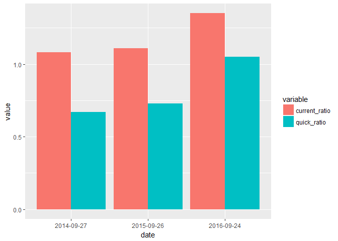

XBRL Automation
================

XBRL Automation
---------------

This project is for the automation of XBRL financial analysis, it acts as an example of how easy automation can be just by learning a few key concepts.

We will use the XBRL API to grab financial statemetns, then use publically avaialble libraries to QA and Analysis the Statements

Installation
------------

If you do not have dev tools already installed, do so, then install the remaining git packages

``` r
#install.packages("devtools")

library(devtools)

#devtools::install_github("bergant/xbrlus") #https://github.com/bergant/xbrlus
#devtools::install_github("bergant/finstr") #https://github.com/bergant/finstr

library(XBRL)
library(xbrlus)
library(finstr)
library(dplyr)
library(tidyr)
library(pander)
```

Getting Data
------------

Initally we are going to use hard coded values, then create a microservice to get them online.

But first, will will need an API key from XBRL

You can get it from here: <https://xbrl.us/home/use/data-analysis-toolkit/>

Then either create a system environment variable XBRLUS\_API\_KEY=APIValueHere or add a new R system variable to .Renviron in your R home (find by using normalizePath("~") in R Console)

Or use the code below each time you run the script, but putting an API key in code is never a good practice

Additional info here: <https://xbrlus.github.io/data_analysis_toolkit/> on the api

``` r
##Uncomment below if seting API key in code
#api_key = "xxxxx"
#Sys.setenv(XBRLUS_API_KEY=api_key)
##

balanceSheetCompare <- function(c1 = "aapl",c2 = "goog",c3 = "fb", year =2016, return_data = FALSE){

  #heavily lifted from example on https://github.com/bergant/xbrlus
  
  cik <- xbrlCIKLookup(c(c1,c2,c3))
  
  elements <- xbrlBaseElement(c(
    "AssetsCurrent",
    "AssetsNoncurrent",
    "Assets",
    "LiabilitiesCurrent",
    "LiabilitiesNoncurrent",
    "Liabilities",
    "StockholdersEquity",
    "MinorityInterest",
    "StockholdersEquityIncludingPortionAttributableToNoncontrollingInterest",
    "LiabilitiesAndStockholdersEquity"
  ))
  
  values <- xbrlValues( 
    CIK = cik$cik, 
    Element = elements$elementName, 
    DimReqd = FALSE, 
    Period = "Y",
    Year = year,
    NoYears = 1,
    Ultimus = TRUE,
    Small = TRUE,
    as_data_frame = TRUE
  )
  
  balance_sheet <- 
    elements %>% 
    left_join(values, by = "elementName") %>% 
    select(entity, standard.text, amount) %>% 
    mutate(amount = round(amount / 10e6,0)) %>%  
    spread(entity, amount)
  
  if(ncol(balance_sheet == 5)) {balance_sheet[,5] <- NULL}

  balance_sheet <- balance_sheet[
    order(order(elements$elementName)),   
    !is.na(names(balance_sheet))]
  row.names(balance_sheet) <- NULL
  
  pandoc.table(
    balance_sheet,
    caption = "Balance Sheet Comparison",
    big.mark = ",",
    split.table = 200,
    style = "rmarkdown",
    justify = c("left", rep("right", 3)))

  
  print(pandoc.table)
  if(return_data){return(balance_sheet)}
  
}
```

This function allows me to compare three ticker symbols for any year I want, pretty cool and it was lifted right from the github of the author so it's basically cut and paste!

It also returns the balance sheet value if I want to get more data

``` r
balanceSheetCompare()
```

<table style="width:100%;">
<caption>Balance Sheet Comparison</caption>
<colgroup>
<col width="62%" />
<col width="13%" />
<col width="10%" />
<col width="12%" />
</colgroup>
<thead>
<tr class="header">
<th align="left">standard.text</th>
<th align="right">Alphabet Inc.</th>
<th align="right">APPLE INC</th>
<th align="right">FACEBOOK INC</th>
</tr>
</thead>
<tbody>
<tr class="odd">
<td align="left">Assets</td>
<td align="right">16,750</td>
<td align="right">32,169</td>
<td align="right">6,496</td>
</tr>
<tr class="even">
<td align="left">Assets, Current</td>
<td align="right">10,541</td>
<td align="right">10,687</td>
<td align="right">3,440</td>
</tr>
<tr class="odd">
<td align="left">Assets, Noncurrent</td>
<td align="right">6,209</td>
<td align="right">NA</td>
<td align="right">NA</td>
</tr>
<tr class="even">
<td align="left">Liabilities</td>
<td align="right">2,846</td>
<td align="right">19,344</td>
<td align="right">577</td>
</tr>
<tr class="odd">
<td align="left">Liabilities and Equity</td>
<td align="right">16,750</td>
<td align="right">32,169</td>
<td align="right">6,496</td>
</tr>
<tr class="even">
<td align="left">Liabilities, Current</td>
<td align="right">1,676</td>
<td align="right">7,901</td>
<td align="right">288</td>
</tr>
<tr class="odd">
<td align="left">Liabilities, Noncurrent</td>
<td align="right">NA</td>
<td align="right">NA</td>
<td align="right">NA</td>
</tr>
<tr class="even">
<td align="left">Stockholders' Equity Attributable to Noncontrolling Interest</td>
<td align="right">NA</td>
<td align="right">NA</td>
<td align="right">NA</td>
</tr>
<tr class="odd">
<td align="left">Stockholders' Equity Attributable to Parent</td>
<td align="right">13,904</td>
<td align="right">12,825</td>
<td align="right">5,919</td>
</tr>
<tr class="even">
<td align="left">Stockholders' Equity, Including Portion Attributable to Noncontrolling Interest</td>
<td align="right">NA</td>
<td align="right">NA</td>
<td align="right">NA</td>
</tr>
</tbody>
</table>


Getting XBRL Ourselves
----------------------

Next we want to look at parsing entire xbrl files we get from EDGAR: <https://www.sec.gov/edgar/searchedgar/companysearch.html>

Again, this is taken right from the github for the library:

``` r
getXbrlStatement <- function(url) {
old_o <- options(stringsAsFactors = FALSE)
fullStatementXbrl <- xbrlDoAll(url, verbose = TRUE)
options(old_o)

bullStatementDF <- xbrl_get_statements(fullStatementXbrl)
}

getBalanceSheet <- function(parsedXBRL){
  if(!is.null(parsedXBRL$StatementOfFinancialPositionClassified)){
    balanceSheet <- parsedXBRL$StatementOfFinancialPositionClassified
  }
  if(!is.null(parsedXBRL$ConsolidatedBalanceSheets)){
    balanceSheet <- parsedXBRL$ConsolidatedBalanceSheets
  }
  return(balanceSheet)
}

getIncomeStatement <- function(parsedXBRL){
  if(!is.null( parsedXBRL$StatementOfIncome)){
    incomeStatement <- parsedXBRL$StatementOfIncome
  }
  if(!is.null( parsedXBRL$ConsolidatedStatementsOfComprehensiveIncome)){
    incomeStatement <- parsedXBRL$ConsolidatedStatementsOfComprehensiveIncome
  }
  return(incomeStatement)
}
```

Financial Analysis
------------------

Here's where it gets incredible, using built in calculation functions in the finstr library, we can take multiple years of data and completely automate the analysis!

``` r
applXBRL2016 <- "https://www.sec.gov/Archives/edgar/data/320193/000162828016020309/aapl-20160924.xml"
applXBRL2015 <- "https://www.sec.gov/Archives/edgar/data/320193/000119312515356351/aapl-20150926.xml"

appl201610K <- invisible(getXbrlStatement(applXBRL2016))
appl201510k <- invisible(getXbrlStatement(applXBRL2015))

appl2016Balance <- getBalanceSheet(appl201610K)
appl2015Balance <- getBalanceSheet(appl201510k)
```

Sweet, we have our statements, now remember in introductory accounting classes how much it work it was to close the books and verify there weren't any errors?

...checking for errors:
``` r
check <- check_statement(appl2016Balance)
check
```

Number of errors: 0 Number of elements in errors: 0

... looking at specific calcuations:
``` r

check$elementId[3]
```

\[1\] "AssetsCurrent"

``` r
check$expression[3]
```

\[1\] "+ CashAndCashEquivalentsAtCarryingValue + AvailableForSaleSecuritiesCurrent + AccountsReceivableNetCurrent + InventoryNet + NontradeReceivablesCurrent + OtherAssetsCurrent"

``` r
check$original[3]
```

...and verification those calcuations are correct:

\[1\] 8.9378e+10

``` r
check$calculated[3]
```

\[1\] 8.9378e+10

hmmm...

Well, there goes a few jobs...

Let's get rid of some more shall we!

We can merge the statements together and do whatever analysis we like, even custom calcuations

``` r
balance_sheet <- merge( appl2015Balance, appl2016Balance )

ratios <- balance_sheet %>% calculate( digits = 2,
  
    current_ratio = AssetsCurrent / LiabilitiesCurrent,
    
    quick_ratio =  
      ( CashAndCashEquivalentsAtCarryingValue + 
          AvailableForSaleSecuritiesCurrent +
          AccountsReceivableNetCurrent
        ) / LiabilitiesCurrent
    
)
```

Year over year ratios:

``` r
 pandoc.table(
        ratios,
        caption = "Year Over Year Ratios",
        big.mark = ",",
        split.table = 200,
        style = "rmarkdown",
        justify = c("left", rep("right", 2)))
```

| date       |  current\_ratio|  quick\_ratio|
|:-----------|---------------:|-------------:|
| 2014-09-27 |            1.08|          0.67|
| 2015-09-26 |            1.11|          0.73|
| 2016-09-24 |            1.35|          1.05|

Making a plot
-------------

And last but not least a quick visual to show some things aren't as easy in R :)

``` r
library(ggplot2)
library(reshape2)
```

First we have to make our data 'long' for it to work appropriately in ggplot:

``` r
long_df <- invisible(melt(ratios)) #invisible to hide log output
```

    ## Using date as id variables

``` r
pandoc.table(
  long_df,
  caption = "Ratios in Long Format",
  big.mark = ",",
  split.table = 200,
  style = "rmarkdown",
  justify = c("left", rep("right", 2)))
```

| date       |        variable|  value|
|:-----------|---------------:|------:|
| 2014-09-27 |  current\_ratio|   1.08|
| 2015-09-26 |  current\_ratio|   1.11|
| 2016-09-24 |  current\_ratio|   1.35|
| 2014-09-27 |    quick\_ratio|   0.67|
| 2015-09-26 |    quick\_ratio|   0.73|
| 2016-09-24 |    quick\_ratio|   1.05|

Then we have to use the unusual langague of ggplot to make a chart, it looks cool, but the syntax is... less than obvious...

``` r
ratio_plot <-   ggplot(data = long_df, aes(x=date, y=value, fill = variable)) 

ratio_plot <- ratio_plot + geom_bar(stat="identity", position=position_dodge())

ratio_plot
```


